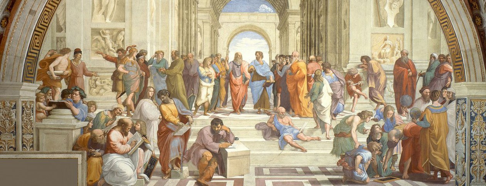

```{r setup, include=FALSE}
knitr::opts_chunk$set(echo = TRUE)

# Load libraries
library(dplyr)
library(ggplot2)
library(tidytext)
library(tidyr)
library(sentimentr)
library(igraph)
library(ggraph)
library(knitr)
library(topicmodels)
library(tm)
library(scales)
library(DT)
library(RColorBrewer)

# Load data
dat <- read.csv("../data/philosophy_data.csv")
```



## Introduction

What is philosophy? According to Britannica, philosophy is the rational, abstract, and methodical consideration of reality as a whole or of fundamental dimensions of human existence and experience ([Britannica, 2020][Britannica, 2020]). It is quite a mouthful of technical jargons, but in short, it is the study of ideas about knowledge, truth, the nature and the meaning of life.

Philosophy is a field that has always eluded me. Not because of the lack of interest in the subject, but more of the intangibleness of its contents -- we are dealing with things that are, as far as our personal experiences are concerned, entirely abstract and non-tangible. Furthermore, philosophy often involves claims about experience itself rather than the content of experience. That is a mode of thinking that most people are entirely unfamiliar with, and is a mode of thinking that can be difficult to grasp and comprehend. 

So how can we better understand philosophy? Can we break down the different schools of philosophy into nice bite-sized quotable quotes/phrases/words? Are there schools of thought that are more similar to each other? Conventionally, studying philosophy is to see the connection between ideas, and to explicate that connection in a reasoned and logical way. If that is the case, what's stopping us from using modern data science techniques to explore the connection of ideas in philosophical texts and its similarity (in themes) between the other school of thoughts? For layman folks like me who did not study philosophy, **_this project helps us to peer into the world of philosophy as it seeks to uncover key themes in the different schools of philosophy and to see which schools of philosophy are more similar to each other._**

## About the data

The data for this project was taken from the Philosophy Data Project ([Alizadeh, 2021][Alizadeh, 2021]). The data has 360,808 rows and 11 columns and a snippet of the data is shown below. For my analysis, I would mostly be analyzing the texts in the column, `sentence_lowered`.

```{r, echo=FALSE}
glimpse(dat)
```

There are 13 schools of philosophy/thought in the data that I will focus on in this analysis.

```{r, echo=FALSE}
unique(dat$school)
```

Are the schools balanced in terms of their word lengths? Based on the word count distribution below, the schools of `aristotle`, `german_idealism` and `analytic` have the highest amount of words while `stoicism` has the least amount of words. Looks like *Aristotle* had a lot of things to say in his works! 

```{r, echo=FALSE}
p1 = dat %>%
  select(school, sentence_lowered) %>%
  group_by(school) %>%
  unnest_tokens(output = word, input = sentence_lowered) %>%
  summarise(word_count = n()) %>%
  ggplot(aes(x=reorder(school, word_count), y=word_count)) +
  geom_col(fill = "#40B5AD") + 
  coord_flip() +
  labs(title = "Distribution of word counts by schools",
       x = "school",
       y = "word count") +
  scale_y_continuous(labels = comma) +
  theme_classic()

p1
```

Finally, the average dates of when the various schools published their works are listed below (dates are important because they would have had influences on the philosophical themes during that era). The schools of `plato` and `aristotle` originated circa 300 BC, which makes sense because that was the era where Plato and Aristotle lived in (the Classical Period in Ancient Greece). On the other hand, the school of `stoicism` originated circa AD 160 -- without looking into the data, I am guessing that this school might borrow themes of the early Christian faith because of its proximity (in time and location) to the events of Christ (we will delve into the themes in the next section). The rest of the schools originated from the 1700s and beyond, which would likely exhibit more postmodern thinking.

```{r, echo=FALSE}
sch_date = dat %>%
  group_by(school) %>%
  summarise(avg_date = mean(original_publication_date)) %>%
  arrange(avg_date)

sch_date
```

## What are the key themes in each philosophical school?

I approached this question by treating each text as a "bag of words" where the words are examined independent of their position in text. I employed text mining techniques such as tokenization from `tidytext::unnest_tokens()` on the sentences in the data. This essentially "chops" the sentences into words, i.e., the text is decomposed into tokens. By default, each token is a word. But words alone do not convey much context, therefore, I used the ngram tokens to decompose the texts into word pairs, which would give better context for the analyzed texts.

After getting the counts of the biwords/word pairs, I visualized the connection of the words with a network diagram using `igraph::graph_from_data_frame()` and `ggraph::ggraph()`. The thicker the lines between words, the greater the term frequency. For each of the 13 schools, I will attempt to explain some of the salient word-pairs as highlighted by the network diagrams below.

To note: the subsequent network diagrams are ordered from the oldest publication date to the latest.

```{r, echo=FALSE}
# This code chunk does the tokenization for word pairs 
# and stores the dataframe into a list for each school
# Only top 30 results are stored

# Initialization
schools = unique(dat$school)
biword_counts = list()
i = 1

# Add some words to stop_words
stop_words_added = data.frame(word = c("ï", "î"), lexicon = "marcus") %>%
  rbind(stop_words)

# Loop to perform tokenization for each school
for (school in schools){
  # Store biword counts for each school
  biword_counts[[i]] = dat %>%
    filter(school == schools[i]) %>%
    unnest_tokens(input=sentence_lowered, output=word, token="ngrams", n=2) %>%
    separate(word, c("word1", "word2"), sep=" ") %>%
    filter(!word1 %in% stop_words_added$word) %>%
    filter(!word2 %in% stop_words_added$word) %>% 
    select(word1, word2) %>%
    count(word1, word2, sort=T) %>%
    slice(1:30)
  
  # increment counter
  i = i + 1
}
```

### Plato (circa 350 BC)

*Plato* was an athlete and he said a lot about physical fitness, so much so he placed them into a bigger framework that encompassed state policies, military strategies and educational programs. This could explains why *"physical training"* occurred often in his works.

```{r, echo=FALSE}
p_plato = biword_counts[[1]] %>%
  graph_from_data_frame() %>%
  ggraph(layout = "fr") +
  geom_edge_link(aes(edge_alpha = n, edge_width = n), edge_colour = "cyan4") +
  geom_node_point(size = 3) +
  geom_node_text(aes(label = name), repel = T,
                 point.padding = unit(0.2, "lines")) +
  theme_graph() +
  theme(legend.position = "none")

p_plato
```

### Aristotle (circa 320 BC)

As a logician, *Aristotle* was most notable for his theory of inference. The *"middle term"* that showed up in the network diagram refers to his theory of inferences (aka syllogism), where it is a term that appears as a subject/predicate/proposition in both premises but not in the conclusion (complicated right?). To simplify, let me give an example:

* Major premise: All **men** are mortal.
* Minor premise: Aristotle is a **man**.
* Conclusion: Aristotle is mortal.

The middle terms are **bolded** above. 

```{r, echo=FALSE}
p_aristotle = biword_counts[[2]] %>%
  graph_from_data_frame() %>%
  ggraph(layout = "fr") +
  geom_edge_link(aes(edge_alpha = n, edge_width = n), edge_colour = "cyan4") +
  geom_node_point(size = 3) +
  geom_node_text(aes(label = name), repel = T,
                 point.padding = unit(0.2, "lines")) +
  theme_graph() +
  theme(legend.position = "none")

p_aristotle
```

### Stoicism (circa 164 AD)

*Stoicism* teaches us how to treat others. For example, "thou shalt not do unto others what you would not do unto thyself." (paraphrased from Matthew 7:12). In even simpler words, it means to treat others as you would like to be treated by them. As can be seen from the language used, this explains why *"thou shalt"*, *"thou art"*, *"thou hast"* and *"thy mind"* appeared significantly in the texts of *Stoicism*.

```{r, echo=FALSE}
p_stoicism = biword_counts[[11]] %>%
  graph_from_data_frame() %>%
  ggraph(layout = "fr") +
  geom_edge_link(aes(edge_alpha = n, edge_width = n), edge_colour = "cyan4") +
  geom_node_point(size = 3) +
  geom_node_text(aes(label = name), repel = T,
                 point.padding = unit(0.2, "lines")) +
  theme_graph() +
  theme(legend.position = "none")

p_stoicism
```

### Rationalism (circa 1681 AD)

In *Rationalism*, one of the notable philosophers, René Descartes, posits that *"animal spirits"* are responsible for physical stimulations that cause their body to move; the notion that these "spirits" function in a way that is similar to the body's nervous system is a key concept to understanding the physiology described by Descartes. Another philosopher of *Rationalism*, Gottfried Leibniz, also believed that animals have spirits and souls. This is the reason why *"animal spirits"* were frequently mentioned in the network diagram.

```{r, echo=FALSE}
p_rationalism = biword_counts[[4]] %>%
  graph_from_data_frame() %>%
  ggraph(layout = "fr") +
  geom_edge_link(aes(edge_alpha = n, edge_width = n), edge_colour = "cyan4") +
  geom_node_point(size = 3) +
  geom_node_text(aes(label = name), repel = T,
                 point.padding = unit(0.2, "lines")) +
  theme_graph() +
  theme(legend.position = "none")

p_rationalism
```

### Empiricism (circa 1716 AD)

The founder of *Empiricism*, John Locke, asserts that the human mind is like a clean slate of blank canvas, which gets populated with information through life's experiences. The way we formulate our ideas through experiences has two main steps: First, we acquire *"simple ideas"* through our experiences, and these *"simple ideas"* are synthesized to create *"complex ideas"*.

```{r, echo=FALSE}
p_empiricism = biword_counts[[3]] %>%
  graph_from_data_frame() %>%
  ggraph(layout = "fr") +
  geom_edge_link(aes(edge_alpha = n, edge_width = n), edge_colour = "cyan4") +
  geom_node_point(size = 3) +
  geom_node_text(aes(label = name), repel = T,
                 point.padding = unit(0.2, "lines")) +
  theme_graph() +
  theme(legend.position = "none")

p_empiricism
```

### German idealism (circa 1803 AD)

Immanuel Kant, a philosopher of *German Idealism*, argues that the human understanding is the source of the general laws of nature that structure all our experience, and that human reason gives itself the *"moral law"*, which is our basis for our belief in God, freedom and immortality. He also criticized *"pure reason"*, which led to his book, Critique of Pure Reason.

```{r, echo=FALSE}
p_gerideal = biword_counts[[8]] %>%
  graph_from_data_frame() %>%
  ggraph(layout = "fr") +
  geom_edge_link(aes(edge_alpha = n, edge_width = n), edge_colour = "cyan4") +
  geom_node_point(size = 3) +
  geom_node_text(aes(label = name), repel = T,
                 point.padding = unit(0.2, "lines")) +
  theme_graph() +
  theme(legend.position = "none")

p_gerideal
```

### Capitalism (circa 1813 AD)

*Capitalism* needs no introduction and the network diagram is splotched with capitalist jargons like *"marginal efficiency"*, *"foreign trade"*, *"raw produce"*, etc. The main idea of *Capitalism* is a system in which private actors own and control property in accordance to their own interests, and that demand and supply freely set prices in markets that serve the best interests of society. In short, the purpose of *Capitalism* is to make a profit.

```{r, echo=FALSE}
p_capital = biword_counts[[10]] %>%
  graph_from_data_frame() %>%
  ggraph(layout = "fr") +
  geom_edge_link(aes(edge_alpha = n, edge_width = n), edge_colour = "cyan4") +
  geom_node_point(size = 3) +
  geom_node_text(aes(label = name), repel = T,
                 point.padding = unit(0.2, "lines")) +
  theme_graph() +
  theme(legend.position = "none")

p_capital
```

### Communism (circa 1877 AD)

We should also be familiar with *Communism*. Karl Marx used the term *"labour power"* extensively as a key concept in his works to critique capitalist political economies. This explains why this term stands out in the network diagram.

```{r, echo=FALSE}
p_commun = biword_counts[[9]] %>%
  graph_from_data_frame() %>%
  ggraph(layout = "fr") +
  geom_edge_link(aes(edge_alpha = n, edge_width = n), edge_colour = "cyan4") +
  geom_node_point(size = 3) +
  geom_node_text(aes(label = name), repel = T,
                 point.padding = unit(0.2, "lines")) +
  theme_graph() +
  theme(legend.position = "none")

p_commun
```

### Nietzsche (circa 1887 AD)

*Nietzsche* introduced the three metamorphoses in his book, Thus Spoke Zarathustra, which essentially describes the process of spiritual transformation that characterizes his vision of a thriving life. He used Old English terms like *"thou shalt"* in his works. But don't get confused and assume that *Nietzsche* was a spiritual and religious man; in fact, he is the antithesis of that. He attacks Christian beliefs in his book, The Antichrist, where he asserts the *"Christian morality"* as being slavish.

```{r, echo=FALSE}
p_nietzsche = biword_counts[[12]] %>%
  graph_from_data_frame() %>%
  ggraph(layout = "fr") +
  geom_edge_link(aes(edge_alpha = n, edge_width = n), edge_colour = "cyan4") +
  geom_node_point(size = 3) +
  geom_node_text(aes(label = name), repel = T,
                 point.padding = unit(0.2, "lines")) +
  theme_graph() +
  theme(legend.position = "none")

p_nietzsche
```

### Feminism (circa 1933 AD)

The *Feminism* philosophy argues that women are not naturally inferior to men and that they be treated equally with access to similar activities as men. Therefore, we see topics like *"woman suffrage"*, *"women's rights"* and *"birth control"* being raised in the network diagram. We also see a high frequency of *"black women"* and *"white women"* being used in the texts and that could likely be due to the fact that they were the subject of the entire discrimination described in *Feminism*.

```{r, echo=FALSE}
p_feminism = biword_counts[[13]] %>%
  graph_from_data_frame() %>%
  ggraph(layout = "fr") +
  geom_edge_link(aes(edge_alpha = n, edge_width = n), edge_colour = "cyan4") +
  geom_node_point(size = 3) +
  geom_node_text(aes(label = name), repel = T,
                 point.padding = unit(0.2, "lines")) +
  theme_graph() +
  theme(legend.position = "none")

p_feminism
```

### Phenomenology (circa 1938 AD)

Martin Heidegger, a German philosopher, uses the German term, *"da sein"*, which means "being there", "presence" or "human reality/existence". He uses *"da sein"* to refer to the experience of "being" that is unique to human beings and must therefore confront issues such as personhood, mortality and the paradox of living in a relationship with others while being alone with oneself.

```{r, echo=FALSE}
p_pheno = biword_counts[[7]] %>%
  graph_from_data_frame() %>%
  ggraph(layout = "fr") +
  geom_edge_link(aes(edge_alpha = n, edge_width = n), edge_colour = "cyan4") +
  geom_node_point(size = 3) +
  geom_node_text(aes(label = name), repel = T,
                 point.padding = unit(0.2, "lines")) +
  theme_graph() +
  theme(legend.position = "none")

p_pheno
```

### Analytic (circa 1959 AD)

In *Analytic* philosophy, the term *"sense data"* means "what is given to sense" and constitute what we, as perceiving subjects, are directly aware of in perceptual experience, prior to cognitive acts. For example, in our vision, *"sense data"* is described with colors and shapes. Suppose we have a red desk with a green book on it; our *"sense data"* would be a patch of red along with a green rectangular patch on it. Based on these data, we can affirm that a red and a green thing (or a desk and a book) are present before us. Also, the term *"proper names"* are used commonly in *Analytic* philosophy, but I shall not delve too deep on this.

```{r, echo=FALSE}
p_analytic = biword_counts[[5]] %>%
  graph_from_data_frame() %>%
  ggraph(layout = "fr") +
  geom_edge_link(aes(edge_alpha = n, edge_width = n), edge_colour = "cyan4") +
  geom_node_point(size = 3) +
  geom_node_text(aes(label = name), repel = T,
                 point.padding = unit(0.2, "lines")) +
  theme_graph() +
  theme(legend.position = "none")

p_analytic
```

### Continental (circa 1966 AD)

*Continental* philosophy is a set of *"eighteenth century"* and *"nineteenth century"* philosophical traditions from mainland Europe. *Continental* philosophers generally reject the idea that natural *"human sciences"* are the most accurate way of understanding natural phenomena -- in short, scientific methods are inadequate to fully understand and comprehend what we experience in the world.

```{r, echo=FALSE}
p_contin = biword_counts[[6]] %>%
  graph_from_data_frame() %>%
  ggraph(layout = "fr") +
  geom_edge_link(aes(edge_alpha = n, edge_width = n), edge_colour = "cyan4") +
  geom_node_point(size = 3) +
  geom_node_text(aes(label = name), repel = T,
                 point.padding = unit(0.2, "lines")) +
  theme_graph() +
  theme(legend.position = "none")

p_contin
```

## Which schools of philosophy are more similar to each other?

Now that we have a better glimpse and understanding of the different schools of philosophies (in a fast, albeit simplified manner), let's investigate deeper on how similar the various schools of thought are to each other. For this, I will use topic modeling techniques to classify the documents/texts into various topics/themes. Because every document is a mixture of topics, it becomes possible to determine how many percent of a certain topic resides in a particular document, e.g., Document 1 is 80% topic A and 20% topic B. Latent Dirichlet Allocation (LDA) is suitable for this application and will be used for the modeling process.

### Data prep

```{r, echo=FALSE}
# This code chunk combines all texts under each school 
# and stores the dataframe into a list for each school

# Initialization
schools_filtered = list()
i = 1

# Loop to filter for each school and store into dataframe
for (school in schools){
  # Store filtered data for each school
  schools_filtered[[i]] = dat %>%
    filter(school == schools[i])
  # increment counter
  i = i + 1
}
```

```{r, echo=FALSE}
# Combine all individual texts into a
# large text (i.e., book) for each school

# Initialization
sentences_comb = list()
i = 1

# Loop to combine all texts according to school
for (school in schools){
  # Store combined sentences for each school
  sentences_comb[[i]] = combine_words(schools_filtered[[i]]$sentence_lowered)
  # Increment counter
  i = i + 1
}
```

LDA performs better on larger texts and not so well on shorter texts for the simple fact that shorter texts (e.g., tweets) would likely only have one topic. Since we are trying to fit multiple topics in a document (in this case, texts associated to a particular philosophical school), we would need to combine all the sentences into a mega text according to each school. After some data manipulation, the resulting dataframe looks like the dataframe below -- it has 13 rows (for the 13 schools and 13 mega sized texts) and 2 columns. Each row of school would have an amalgamated chunk of text (mega text) that belong to it.   

```{r, echo=FALSE}
# Join the combined sentences with the dataframes
# that have been filtered according to schools

# Initialization
books = list()
i = 1

# Loop to join combined sentences with the filtered data
for (school in schools){
  # Store combined sentences with filtered data
  books[[i]] = schools_filtered[[i]] %>%
    select(school) %>%
    unique() %>%
    mutate(sentence = sentences_comb[[i]])
  # Increment counter
  i = i + 1
}

# Combine all books from each school into one dataframe
books_all = do.call(rbind, books)

# Glimpse
glimpse(books_all)
```

Now I will tokenize the sentences into individual words using `unnest_tokens()` and remove `stop_words`. We will treat every school of philosophy as a separate document. The resulting dataframe `word_counts` below is now in a tidy form and sorted by the highest occurring words as shown below (I will only show top 10 occurring words here). 

```{r, echo=FALSE, message=FALSE}
word_counts = books_all %>%
  unnest_tokens(input = sentence, output = word) %>%
  anti_join(stop_words_added) %>%
  count(school, word, sort = TRUE)

head(word_counts, 10)
```

### LDA on schools

I will now transform the tidy dataframe into a `DocumentTermMatrix` using `cast_dtm()` because `LDA()` requires the data to be in a `DocumentTermMatrix` format. I can then use the `LDA()` function to create a 13-topics model. I used 13 topics specifically because I know there are 13 schools and I'm assuming that they would be distinct from each other (though I know there would be similarities between schools).

```{r, echo=FALSE}
schools_dtm = word_counts %>%
  cast_dtm(school, word, n)

schools_lda = LDA(schools_dtm, k=13, method="Gibbs", 
                  control = list(nstart=5,
                                 seed=list(100, 617, 423, 1234, 777),
                                 best=TRUE,
                                 burnin=4000,
                                 iter=2000,
                                 thin=500))
schools_lda
```

We can now examine the per-topic-per-word probabilities, called $\beta$ (beta) from the model. The dataframe below is in a one-topic-per-term-per-row format, with each combination showing the probability of that term being generated from that topic. For instance, the term "world" has a $9.34\times 10^{-4}$ probability of being generated from topic 1, but a $2.14\times 10^{-2}$ probability of being generated from topic 9. This means that the word "world" has a higher probability of being generated from topic 9.

```{r, echo=FALSE}
school_topics = tidy(schools_lda, matrix = "beta")
school_topics
```

We will then use the `dplyr::slice_max()` function to find the top 5 terms that are most common for each topic. The interactive table below allows us to skim through the top 5 words for each topic. Alternatively, I visualized it in a `ggplot2` plot also shown below.

```{r, echo=FALSE}
top_terms = school_topics %>%
  group_by(topic) %>%
  slice_max(beta, n = 5) %>%
  ungroup() %>%
  arrange(topic, -beta)

datatable(top_terms)

p_topterms = top_terms %>%
  mutate(term = reorder_within(term, beta, topic)) %>%
  ggplot(aes(beta, term, fill = factor(topic))) +
  geom_col(show.legend = FALSE) +
  facet_wrap(~ topic, scales = "free", ncol = 4) +
  scale_y_reordered() + 
  scale_fill_manual(values = colorRampPalette(brewer.pal(11, "RdYlBu"))(13)) +
  theme_classic()

p_topterms
```

It is highly likely that "woman", "women", "love" and "black" from topic 10 belong to the school of *Feminism*, while "price", "money", "labour" and "capital" from topic 5 seem to belong to the school of *Capitalism*. Also, words like "thou", "thy", "ye" and "thee" from topic 6 would likely belong to *Stoicism* or even *Nietzsche* since they use such Old English words in their texts.

### Per-document classification

Each document in this analysis represents a school of philosophy. Therefore, we can know through the value of $\gamma$ (gamma) the per-school-per-topic probabilities. For instance, the model estimates that each word in the *Communism* school/document has a $67\%$ probability of coming from topic 1.

```{r, echo=FALSE}
schools_gamma = tidy(schools_lda, matrix = "gamma")
schools_gamma
```

Finally, we are able to visualize the school-topic probabilities below. This plot becomes very useful in determining which schools are more similar to each other in topic/theme. For instance, both *Stoicism* and *Nietzsche* have a significant probability of coming from topic 6, which makes sense because both these schools use similar Old English languages like "thou shalt", "thyself", etc. 

```{r, echo=FALSE, warning=FALSE}
p_schgamma = schools_gamma %>%
  ggplot(aes(x = reorder(document, as.numeric(document)),
             y = gamma, fill = factor(topic))) +
  geom_bar(position = 'fill', stat='identity') +
  guides(fill = F) +
  coord_flip() +
  scale_fill_manual(values = colorRampPalette(brewer.pal(11, "RdYlBu"))(13)) +
  guides(fill = guide_legend(nrow = 2)) +
  labs(x = "school") +
  theme_classic() +
  theme(legend.position = "bottom") +
  guides(fill = guide_legend(title = "topic"))

p_schgamma
```

On the other hand, *Capitalism* and *Phenomenology* do not seem to be that similar in topics when compared with the rest; they seem to have very distinct topics on their own. I tried to make sense of why they do not share similar topics with the rest. For *Capitalism*, the main motive of this philosophy is to make a profit, which explains the myriad economic terms (e.g., "foreign trade", "raw produce", "marginal efficiency", etc.) that popped up in the network diagram in the previous section. In this regard, *Capitalism* differs significantly with the other schools of philosophy because the rest had words that were more related to human existential meaning. For example, in the network diagrams, "practical wisdom" appeared in *Plato*, "thy mind" in *Stoicism*, "human body" in *Rationalism*, "pure reason" and "moral law" in *German Idealism*, so on and so forth -- words relating more to human existence. Lastly, *Phenomenology* might be distinct from the rest because of the use of German terms (e.g., "da sein").

Also, we notice that every school had slight to moderate similarities of coming from topic 13. On closer examination of the plot with the top 5 word terms above, topic 13's top words were "time", "nature", "life", "reason", etc., which may indicate why every school had a "hint" of topic 13 -- simply because philosophy is essentially the study of ideas about knowledge, truth, the nature and the meaning of life (recall my first stanza in this article), and all schools would have had some tinge of that aspect! Something cool to note also is that *Capitalism* had the lowest probability of coming from topic 13, which corroborates our analysis above (being distinct from the rest) -- it does not really talk much about human existential issues as much as the growth of the economy.

(PS: For those who may not be able to distinguish color palettes clearly, an alternative to visualize the school-topic probabilities is shown below. It essentially talks about the same stuff as the plot above, but without colors.) 

```{r, echo=FALSE}
p_schgamma2 = schools_gamma %>%
  mutate(school = reorder(document, gamma * topic)) %>%
  ggplot(aes(factor(topic), gamma)) +
  geom_boxplot() +
  facet_wrap(~school, ncol = 4) +
  labs(x = "topic") +
  theme_classic()

p_schgamma2
```

## Conclusion

All in all, I hope we had a better grasp (or at least a glimpse) of what each school of philosophy is about with the help of the network diagrams. It is clear that modern data science techniques are able to help us decipher (or break down) large chunks of text and give us hints about what they are about without needing us to ever read the entire works of the philosophers.

Furthermore, the LDA was able to assign various topics to each document/school and it helped us identify similar topics between the different schools of philosophy. *Stoicism* and *Nietzsche* are more similar in topics due to the similarity in language used. On the other hand, *Capitalism* and *Phenomenology* seem to be distinct and different from the rest because one uses very distinct economics terms while the other has words in German.

Finally, every school of philosophy had a fair amount of probability of coming from topic 13, which is likely a topic that covers very generic philosophical words/themes that are more existential in nature like "time", "nature", "life", "reason", etc. Since *Capitalism* addresses less existential issues in general, then it makes sense that it is more distinct as a philosophical school when compared to the rest.

## Limitations

Although we were able to, with the help of LDA, compare the similarities between schools, we are at best, just "clustering" the schools to the topics based on the words used. We have not considered the emotions and sentiments in the analysis, which may give us more information about each school of philosophy. This is a case for future work.

## References

Britannica, T. Editors of Encyclopaedia (2020, August 20). philosophy. Encyclopedia Britannica. https://www.britannica.com/topic/philosophy

Alizadeh, K. (2021, February 9). History of philosophy. Kaggle. Retrieved February 2, 2022, from https://www.kaggle.com/kouroshalizadeh/history-of-philosophy/metadata 


[Britannica, 2020]: https://www.britannica.com/topic/philosophy

[Alizadeh, 2021]: https://www.kaggle.com/kouroshalizadeh/history-of-philosophy/metadata